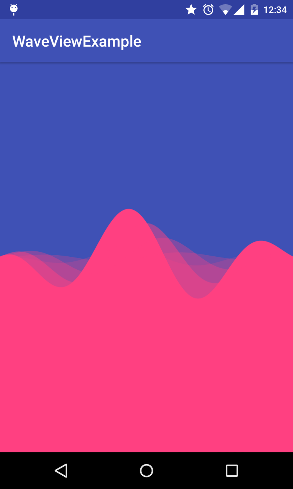

# WaveView
Simple Android library to draw sinusoidal waves.



To add this library to your project, add this to your app level dependencies :

```
compile 'com.narayanacharya:WaveView:0.9.1'
```

To use this you can add this to your layout file :

```
<com.narayanacharya.waveview.WaveView
    android:id="@+id/waveView"
    android:layout_width="match_parent"
    android:layout_height="match_parent" />
```

In order to customize the wave you can:

- Use XML Attributes

```
<com.narayanacharya.waveview.WaveView
        android:id="@+id/waveView"
        android:layout_width="match_parent"
        android:layout_height="match_parent"
        android:layout_gravity="center"
        app:waveAmplitude="0.25"
        app:waveBackgroundColor="@color/colorPrimary"
        app:waveColor="@color/colorAccent"
        app:waveDensity="5.0"
        app:waveFrequency="2.0"
        app:waveNumberOfWaves="5"
        app:wavePhaseShift="-0.05"
        app:wavePrimaryLineWidth="3.0"
        app:waveSecondaryLineWidth="1.0" />
```

- Use a reference in your Activity

```
WaveView sine = (WaveView) findViewById(R.id.waveView);
sine.setBackgroundColor(Color.GRAY);
sine.setWaveColor(Color.WHITE);
sine.setNumberOfWaves(3);
sine.setFrequency(2.0f);
sine.setAmplitude();
sine.setPhaseShift(-0.05f);
sine.setDensity(5.0f);
sine.setPrimaryLineWidth(3.0f);
sine.setSecondaryLineWidth(1.0f);
```
Values shown above are the default values.

The original code was found [here](http://stackoverflow.com/a/33211722/5512274). Cleaned, modified and improved as per requirements though. 

Suggestions, improvements, criticisms and pull requests are all welcome!